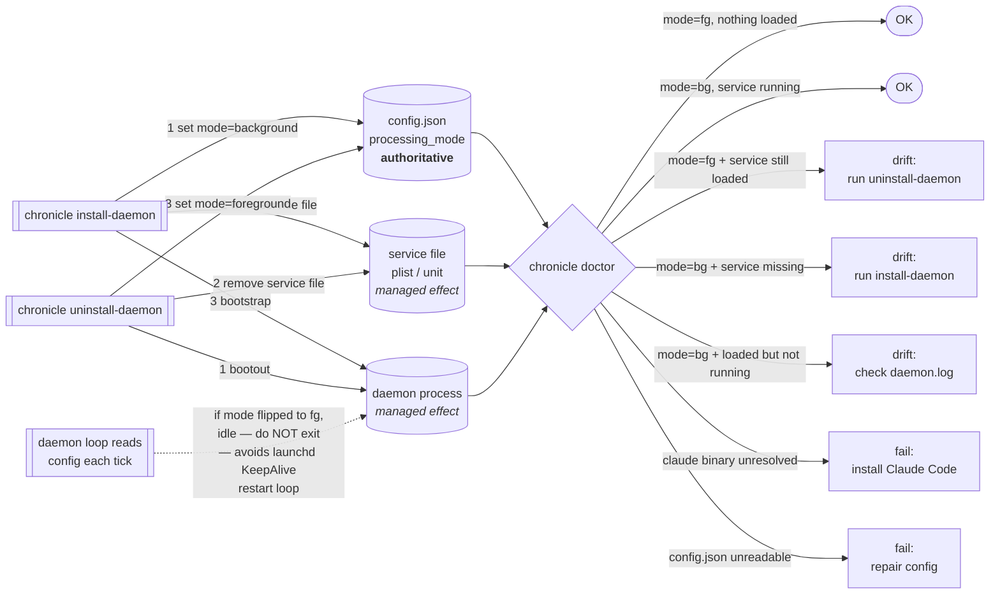
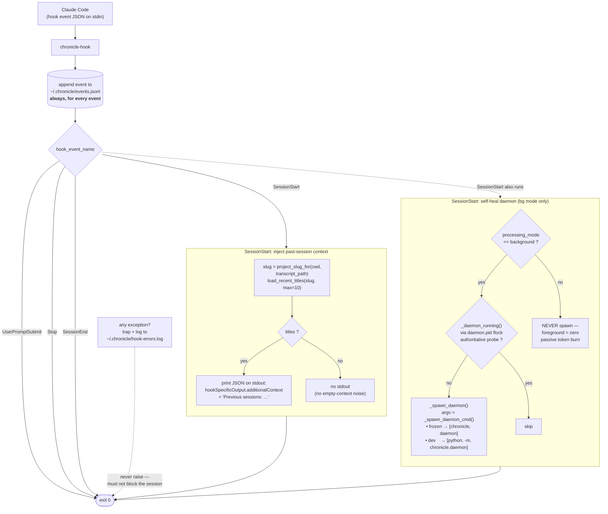
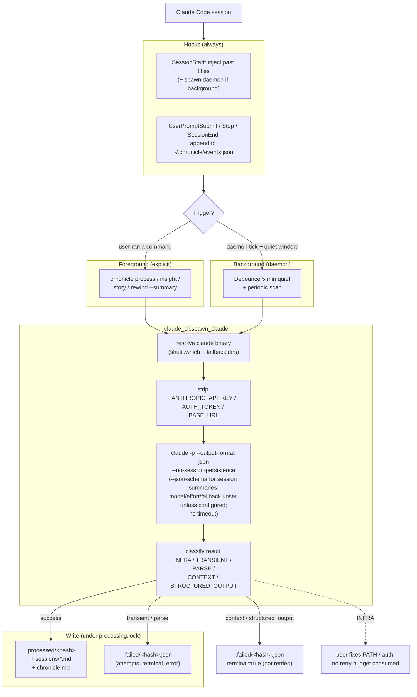
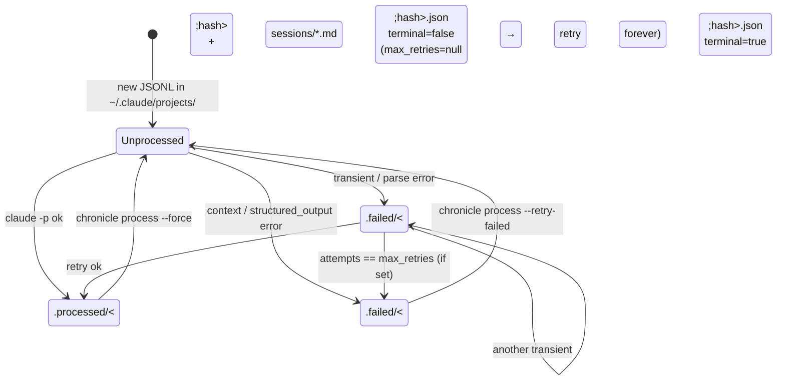
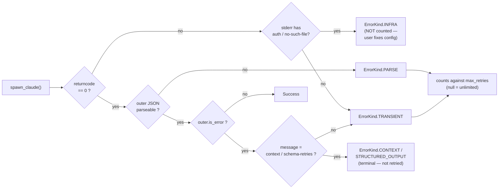

# Decision Chronicle

Records the *reasoning* behind your coding sessions — planning discussions, trade-offs, rejected approaches, debugging context — as searchable markdown. Six months later, the chronicle shows not just what was built, but how it was thought through.

> **Default install is foreground mode.** Chronicle always records hook events and injects past-session context into new Claude Code sessions, but **does NOT run `claude -p` or spend tokens** unless you explicitly run `chronicle process`, `chronicle insight`, `chronicle story`, or `chronicle rewind --summary`. Background auto-summarization is opt-in via `chronicle install-daemon`.

---

## Quick start

**Prerequisites:** macOS (Apple Silicon) or Linux (x86_64) · Claude Code CLI · Claude subscription (Pro / Max / Teams).

Chronicle ships as a prebuilt self-contained binary. No Python, venv, or system package dependencies on the target machine.

##### Default (foreground — zero passive token burn)
```bash
curl -fsSL https://raw.githubusercontent.com/ehzawad/claudetalktoclaude/main/install.sh | bash
```
##### Background mode (daemon auto-summarizes after 5 min quiet)
```bash
curl -fsSL https://raw.githubusercontent.com/ehzawad/claudetalktoclaude/main/install.sh | bash && chronicle install-daemon
```

Pin a specific release: `CHRONICLE_VERSION=vX.Y.Z curl ... | bash`. For mirrors or isolated tests, `CHRONICLE_BASE_URL` overrides the release host and `CHRONICLE_HOME` moves Chronicle's data/runtime root. Upgrade: `chronicle update`.

Restart Claude Code to activate hooks. Then:

```bash
chronicle doctor                    # verify everything resolves
chronicle query projects            # show per-project session counts
chronicle process --workers 5       # summarize pending sessions (foreground)
```

If your shell still says `chronicle: command not found` after install, verify
the symlink before assuming a shell or macOS problem:

```bash
command -v chronicle
ls -l ~/.local/bin/chronicle ~/.chronicle/runtime/chronicle
```

If `~/.chronicle/runtime/chronicle` exists but `~/.local/bin/chronicle` does
not, rerun `install.sh` to restore the symlink. A separate tool such as
`codex-chronicle` does not replace or shadow the `chronicle` command; they
coexist under different names.

Switch modes anytime:

```bash
chronicle install-daemon            # → background
chronicle uninstall-daemon          # → foreground
```

### What `install.sh` actually does

```mermaid
flowchart TB
    START([curl -fsSL install.sh &#124; bash]) --> PLAT["detect platform<br/>(darwin-arm64 / linux-x86_64)"]
    PLAT --> DEPS["check curl, tar, claude<br/>(fail fast if missing)"]
    DEPS --> URLS["resolve asset URL<br/>(latest or CHRONICLE_VERSION)"]
    URLS --> DL["download chronicle-$TARGET.tar.gz<br/>+ chronicle-$TARGET.tar.gz.sha256"]
    DL --> VERIFY{"SHA256 match?"}
    VERIFY -->|no| ABORT([abort — no files touched])
    VERIFY -->|yes| STOPD["if daemon running,<br/>launchctl bootout /<br/>systemctl stop<br/>(fallback SIGTERM only<br/>for unmanaged daemon)"]
    STOPD --> LEGACY{"legacy<br/>~/.chronicle/src ?"}
    LEGACY -->|yes| WIPE["rm -rf legacy<br/>source-tree install<br/>(pre-v0.8.0)"]
    LEGACY -->|no| QUAR
    WIPE --> QUAR["macOS: xattr -dr<br/>com.apple.quarantine<br/>(skip Gatekeeper kill)"]
    QUAR --> HOOKS["validate new runtime:<br/>chronicle install-hooks<br/>(merge into ~/.claude/settings.json)"]
    HOOKS --> SWAP["atomic swap:<br/>runtime.new &rarr; runtime<br/>runtime &rarr; runtime.old &rarr; rm"]
    SWAP --> LINK["symlink<br/>~/.local/bin/chronicle{,-hook}<br/>&rarr; runtime/chronicle"]
    LINK --> CHMOD["chmod 700 ~/.chronicle/"]
    CHMOD --> BG{"mode ==<br/>background<br/>(from config) ?"}
    BG -->|yes| KICK["launchctl bootstrap /<br/>systemctl start<br/>(new binary hot)"]
    BG -->|no| DONE
    KICK --> DONE([restart Claude Code])

    CU[["chronicle update"]] -.->|re-runs install.sh<br/>one source of truth| START
    CUN[["chronicle uninstall<br/>[--purge]"]] -->|inverse path:<br/>stop daemon &rarr; strip hooks &rarr;<br/>rm symlinks &rarr; rm runtime/| CDN([user data preserved<br/>unless --purge])
```



---

## Processing modes

| | Foreground (default) | Background (opt-in) |
|---|---|---|
| Hooks record session events | yes | yes |
| Past-session titles injected into new sessions | yes | yes |
| Auto-summarization | **no** | after 5 min of quiet |
| Passive token burn | zero | per-session |
| Runs a service | **no** | launchd (macOS) / systemd --user (Linux) |
| Enable | (default) | `chronicle install-daemon` |
| Disable | (default) | `chronicle uninstall-daemon` |

Mode is stored in `~/.chronicle/config.json` under `processing_mode`. `chronicle doctor` reports current mode plus any drift (e.g., config says foreground but a stale daemon is running).

### Config authority vs. observed effects



---

## Daily use

### Browse

```bash
chronicle query projects              # per-project OK / Pend / Fail counts
chronicle query timeline --limit 20    # recent sessions across all projects
chronicle query timeline --project api # recent sessions matching a project
chronicle query sessions [PATH|--project NAME]  # a project's chronicle (default: cwd)
chronicle query search "auth"          # full-text across all chronicles
chronicle query search "auth" --project api
chronicle query show <project-name>    # show a project's chronicle by name
chronicle query <project-name>         # shortcut for `query show`
```

Project names are matched by the folder **basename** you see (e.g. `codex-council`,
`my_proj`) as well as any substring of the stored slug — whatever name a command
prints back is a name you can type. Lists (`projects`, `timeline`) show the
de-dashed slug to disambiguate same-named folders; single-project views show the
folder basename.

### Process (summarize sessions)

```bash
chronicle process --workers 5                  # pending sessions
chronicle batch --workers 5                    # alias for process
chronicle process --project NAME               # match by basename or slug substring
chronicle process --force --workers 5          # reprocess successes
chronicle process --retry-failed --workers 5   # retry terminal failures
chronicle process --dry-run                    # preview only
```

### Analyze (existing chronicle data)

```bash
chronicle rewind                      # numbered session list
chronicle rewind <N>                  # show session #N
chronicle rewind --since <N>          # sessions #N through latest
chronicle rewind --diff <N>           # what was NEW in session #N
chronicle rewind --summary <N>        # AI-summarize #N onward (calls claude -p)
chronicle rewind --project NAME       # target a specific project slug match
chronicle rewind --delete <N>         # remove one session's records
chronicle rewind --prune              # delete sessions with 0 decisions
chronicle insight [project]           # HTML dashboard (calls claude -p)
chronicle story [project]             # unified narrative md (calls claude -p)
```

### Diagnose / mode switching

```bash
chronicle doctor                      # human-readable diagnostic
chronicle doctor --json               # machine-readable (CI-friendly)
chronicle install-daemon              # switch to background mode
chronicle uninstall-daemon            # switch to foreground mode
chronicle update                      # fetch + install the latest release, restart daemon if running
chronicle uninstall                   # remove binary + hooks + daemon; preserve ~/.chronicle data
chronicle uninstall --purge --yes     # also delete ~/.chronicle (events.jsonl, config, logs)
chronicle uninstall --dry-run         # print what would be removed without executing
chronicle install-hooks [settings]     # merge hooks into Claude Code settings
chronicle daemon [--bg|--stop|--status] # raw/manual daemon control
chronicle --version
```

> Commands that spawn `claude -p` are: `process`, `insight`, `story`, `rewind --summary`, and the background daemon. Nothing else spends tokens.

---

## Concepts

**Session** — one conversation with Claude Code. Stored as `~/.claude/projects/<slug>/<session-id>.jsonl`.

**Project slug** — Claude Code's project directory name (the storage key under `~/.chronicle/projects/`). Chronicle prefers the transcript file's parent directory when available; otherwise it replaces every non-alphanumeric character in the working directory with `-` without collapsing runs. For example `/Users/alice/.config/my_api` → `-Users-alice--config-my-api`. Commands *display* the folder basename (`my_api`) or, in cross-project lists, the de-dashed slug (`Users-alice--config-my-api`) — never the raw leading dash.

**Project matching** — `--project <name>` (and `chronicle query show <name>`) matches a slug that contains `<name>` **or** whose displayed basename you typed — so the punctuation-normalized form matches too: `--project my_api` finds `-Users-alice--config-my-api` even though the slug stores `my-api`. See all your slugs: `chronicle query projects`.

**Marker state** — each session is in exactly one state: unprocessed (no marker), success (`.processed/<hash>`), or failed (`.failed/<hash>.json` with `terminal` flag + attempt counter). See [State and failures](#state-and-failures).

---

## Hook dispatch

The configured Claude Code hook events (`SessionStart`, `UserPromptSubmit`, `Stop`, and `SessionEnd`) fire `chronicle-hook` (the same binary, dispatched by `argv[0]` via `_entrypoint.py`). Every configured event appends a line to `events.jsonl`; only `SessionStart` does anything extra.



> The service manager's own respawn (launchd `KeepAlive` / systemd `Restart=on-failure`) is the primary recovery path. `_spawn_daemon` is defense-in-depth for the window between a daemon crash and the service manager noticing.

---

## How processing works

Both foreground and background use the same pipeline. The only difference is *who triggers it*.



**Five-step invariant** on every summarization (foreground or background):

1. Extract the session JSONL **in full** (no Chronicle size cap), redact secrets (API keys, tokens, JWTs, connection URIs, `.env`/`.pem`/`.key` contents).
2. Resolve the `claude` binary; build a subprocess env with auth-routing vars stripped.
3. Invoke `claude -p` under the processing lock (`~/.chronicle/processing.lock`) with **no wall-clock timeout** — it runs as long as claude needs and stays Ctrl-C/SIGTERM interruptible. Prompts above the Claude CLI's 10 MiB stdin cap are classified as terminal context failures before spawning.
4. Classify the outcome: success / transient / parse / infra / context / structured_output.
5. Write `.processed/` (success) or `.failed/` (transient → terminal after `max_retries`; context/structured_output → terminal immediately).

---

## Background mode internals

Only relevant if you `chronicle install-daemon`.

- **Debounce.** The daemon waits until ALL sessions across ALL projects have been quiet for `quiet_minutes` (default 5) before processing anything. This prevents the daemon from competing with your active coding session for the same subscription rate limits.
- **Periodic scan.** Every `scan_interval_minutes` (default 30) the daemon walks `~/.claude/projects/` and queues any session JSONL that has no `.processed` or `.failed` marker — picks up sessions that pre-date the install or were missed while the daemon was down.
- **Parallel workers.** Up to `concurrency` (default 5) summarizations run concurrently via `asyncio.Semaphore`. Each worker is an independent `claude -p` subprocess.
- **Singleton.** Single daemon enforced by `fcntl.flock` on `~/.chronicle/daemon.pid` plus inode-validation to detect PID-file replacement.
- **Graceful shutdown.** On SIGTERM/SIGINT/SIGHUP, the daemon terminates in-flight `claude` subprocesses (SIGTERM then SIGKILL after 5s) before exiting.
- **Service-manager-aware batch.** In background mode, `chronicle process` pauses the service (`launchctl bootout` / `systemctl --user stop`) and holds the processing lock, then resumes after. In foreground mode the pause step is a no-op and only the processing lock is taken.
- **Self-disable.** If config says foreground but the service respawned the daemon anyway, the daemon idles instead of exiting — avoids a KeepAlive restart loop.

### Concurrency: how the daemon and `chronicle process` don't race

Two `fcntl.flock` locks cover every way sessions can get summarized. Both are released automatically when the owning process exits — crashes don't wedge anything.

```mermaid
flowchart TB
    subgraph locks["fcntl locks (released on process exit)"]
        direction LR
        L1[("daemon.pid<br/><b>singleton:</b> at most one daemon")]
        L2[("processing.lock<br/><b>mutex:</b> daemon XOR chronicle process")]
    end

    subgraph daemon_side["daemon.py (background only)"]
        direction TB
        D1["acquire_daemon_lock()<br/>LOCK_EX &#124; LOCK_NB"]
        D2["inode check each loop tick"]
        D3["non-blocking acquire of<br/>processing.lock before<br/>each debounced batch"]
        D4{"lock still on<br/>same inode ?"}
        D1 --> D2 --> D3
        D2 -.-> D4
        D4 -->|no| BAIL["another daemon took over<br/>(PID file replaced)<br/>&rarr; exit cleanly"]
    end

    subgraph batch_side["batch.py (chronicle process)"]
        direction TB
        B1["is_background_mode() ?<br/>→ pause_service()<br/>(launchctl bootout /<br/>systemctl stop)"]
        B2["<b>blocking</b> acquire of<br/>processing.lock<br/>(waits out an in-flight<br/>daemon batch)"]
        B3["summarize workers<br/>(parallel, semaphore)"]
        B4["release lock<br/>finally: resume_service()"]
        B1 --> B2 --> B3 --> B4
    end

    D1 --> L1
    D3 --> L2
    B2 --> L2

    note["<b>Invariants</b><br/>• at most 1 daemon per host (L1)<br/>• at most 1 summarizer holder (L2)<br/>• service pause is hygiene;<br/>  processing.lock is correctness"]
```



---

## State and failures

### Marker state machine



**Infra errors don't enter this state machine.** A missing `claude` binary, auth failure, or permission error is a daemon-level problem, not a per-session one — no marker is written, no retry budget consumed.

### Error classification



To inspect current failure state: `chronicle doctor` (or `chronicle doctor --json`). To retry after fixing the underlying issue: `chronicle process --retry-failed --workers 5`.

---

## Output and storage

Each project gets up to three views:

| Output | What it is | How to access |
|---|---|---|
| `chronicle.md` | Cumulative session records per project | `chronicle query sessions` |
| `insight.html` | LLM-generated HTML dashboard with charts + narrative | `chronicle insight [project]` |
| `story.md` | Unified chronological project narrative | `chronicle story [project]` |

### Where things live

Default paths below use `~/.chronicle/`; set `CHRONICLE_HOME` to move Chronicle's state and runtime root.

```
~/.claude/projects/<slug>/*.jsonl       # Claude Code session transcripts (source)

~/.chronicle/
  events.jsonl                          # hook event journal
  events.offset                         # daemon read position (background only)
  config.json                           # processing_mode + model + concurrency + …
  daemon.pid                            # singleton lock (background only)
  daemon.log                            # daemon stdout/stderr (background only)
  processing.lock                       # mutex between daemon and `chronicle process`
  runtime/                              # unpacked PyInstaller binary (`chronicle update` swaps this atomically)
  .processed/<hash>                     # success marker
  .failed/<hash>.json                   # failure record (attempts, terminal, error)
  projects/<slug>/
    chronicle.md                        # cumulative project log
    insight.html                        # `chronicle insight` output
    story.md                            # `chronicle story` output
    sessions/
      2026-04-01_0611_abc12345_title.md # per-session record

~/Library/LaunchAgents/com.chronicle.daemon.plist   # macOS service (background only)
~/.config/systemd/user/chronicle-daemon.service     # Linux service (background only)
```

### What gets captured in session `.md`

LLM-structured fields: decisions with status + rationale + alternatives · problems solved (symptom/diagnosis/fix/verification) · developer reasoning moments · follow-up questions · architecture patterns · planning evolution · technical details (stack, errors, commands, config) · notable activity for Agent Teams/tasks/workflows/MCP/new tools · tags and unknown structured extras · per-session cost.

**Full, untruncated archive.** A chronicle is a *complete* record — the turn-by-turn log preserves every tool call's **full** input and **full** output verbatim, no matter how large (full Bash commands, complete Edit/Write/MultiEdit diffs, entire subagent prompts, whole MCP payloads, complete tool output). Nothing is clipped. Long bodies are wrapped in collapsible `<details>` blocks with dynamically-sized backtick fences (always longer than any backtick run inside the content) so embedded code fences can never corrupt the markdown, and they stay scannable via a compact one-line index above each block. Secret redaction still runs on every captured field before anything is written. The only compact-by-design surfaces are the per-project `chronicle.md` **timeline table** (a navigational index whose full title/summary live in the detail section directly below) — every byte of actual history is retained in full.

---

## Configuration

`~/.chronicle/config.json` (auto-created):

| Key | Default | Scope | Description |
|---|---|---|---|
| `processing_mode` | `"foreground"` | both | `"foreground"` or `"background"`. Set via `chronicle install-daemon` / `uninstall-daemon`. |
| `model` | `null` | both | Summarization model. `null` ⇒ let `claude -p` use its own default (auto-follows Claude Code). Set e.g. `"opus[1m]"` for the 1M-context window on very large sessions. |
| `effort` | `null` | both | Reasoning effort passed to `--effort`. `null` ⇒ claude's default. |
| `fallback_model` | `null` | both | `--fallback-model` (sent only when set). `null` avoids silently dropping to a smaller-context model. |
| `max_retries` | `null` | both | Transient/parse failures flip terminal after N attempts. `null` ⇒ unlimited (never give up). Context-window and structured-output failures are always terminal immediately. |
| `skip_projects` | `[]` | both | Project slugs (substrings) to exclude. |
| `concurrency` | `5` | background | Parallel workers in the daemon. (`chronicle process --workers` overrides for that invocation.) |
| `poll_interval_seconds` | `5` | background | Daemon event-journal poll cadence. |
| `quiet_minutes` | `5` | background | Debounce — minutes of silence before daemon processes. |
| `scan_interval_minutes` | `30` | background | How often the daemon scans for non-terminal sessions missed by hook events. |

---

## Security

- **Secret redaction.** User/assistant prose, tool commands, selected tool inputs, tool outputs, and summarization error messages pass through a pattern scanner before any markdown or marker detail is written. API keys (`sk-`, `ghp_`, `AKIA`, `xoxb-`), auth headers (`Bearer …`), private keys (`-----BEGIN …`), JWTs (`eyJ…`), connection URIs (`postgres://user:pass@…`), and env-var assignments (`API_KEY=…`, `SECRET=…`) are replaced with `[REDACTED]`. `.env`, `.pem`, and `.key` file content is fully redacted.
- **Subscription routing.** Every `claude -p` subprocess call strips `ANTHROPIC_API_KEY`, `ANTHROPIC_AUTH_TOKEN`, and `ANTHROPIC_BASE_URL` from the environment — summarization always routes through your Claude.ai subscription, never API credits or a proxy gateway ([anthropics/claude-code#2051](https://github.com/anthropics/claude-code/issues/2051)).
- **File permissions.** `~/.chronicle/` is `0700` (owner-only), matching `~/.claude/`.
- **Observer-only at runtime.** Chronicle never writes to `~/.claude/projects/` (the session transcripts), never blocks a hook, never modifies Claude Code behavior. The only effect on an active session is the `additionalContext` injection of past session titles on SessionStart. All deletion operations (`rewind --delete`, `--prune`) only touch chronicle's own markdown and markers — the original JSONL in `~/.claude/projects/` stays. Install / uninstall are the one exception: `install-hooks` and `uninstall` do edit `~/.claude/settings.json` to add or remove the `chronicle-hook` entries, and they preserve any unrelated hook entries already there.

---

## Troubleshooting

Run `chronicle doctor` first. It reports:

- Resolved `claude` binary path (or flags it as missing)
- Effective PATH
- Current mode + daemon status + service drift warnings
- Processing lock state
- Aggregate processed / pending / terminal-failure counts and marker totals
- Integration state for symlinks, runtime binary, and hook entries

Common fixes:

- **`claude` not found.** Install the Claude Code CLI, or ensure it's on the daemon's PATH. `chronicle install-daemon` bakes PATH into the launchd plist / systemd unit so minimal service-manager envs (`/usr/bin:/bin:/usr/sbin:/sbin`) don't cause `FileNotFoundError`.
- **`chronicle` not found, but runtime exists.** Check `ls -l ~/.local/bin/chronicle ~/.chronicle/runtime/chronicle`. If the runtime binary exists but the `~/.local/bin/chronicle` symlink is missing, rerun `install.sh` (or `chronicle update` if the command still resolves anywhere) to restore it.
- **`codex-chronicle` is installed too.** That is not a name collision. `codex-chronicle` and `chronicle` are separate commands with separate install roots.
- **Mode drift warning.** Config says one mode but service state says another. `chronicle install-daemon` / `uninstall-daemon` reconciles.
- **Terminal failures after fixing a config issue.** `chronicle process --retry-failed --workers 5`.
- **Ubuntu background mode survives logout.** Run once: `sudo loginctl enable-linger "$USER"`.
- **Scripted health check.** `chronicle doctor --json` emits a schema-versioned document with a top-level `ok: bool`; exit code is 0 if healthy, 1 if any of: drift detected, `claude` binary unresolved, or `config.json` unreadable.

---

## Developer map

```
chronicle/
  __main__.py          # CLI dispatcher (process / query / rewind / insight /
                       #   story / doctor / install-daemon / uninstall-daemon /
                       #   daemon / install-hooks / update / uninstall)
  _entrypoint.py       # PyInstaller busybox dispatcher — argv[0] picks
                       #   between chronicle CLI and chronicle-hook
  hook.py              # hook dispatcher — logs events, injects context,
                       #   spawns daemon (background only)
  daemon.py            # background poll loop, debounce, scan, parallel workers
  batch.py             # `chronicle process` — service-manager-aware batch
  summarizer.py        # build prompt + parse structured_output → ChronicleEntry
  extractor.py         # JSONL → SessionDigest + timeline (with secret redaction)
  storage.py           # marker layout (.processed, .failed) + chronicle.md writes
  filtering.py         # should_skip: success / terminal / skip-project / self
  query.py             # query projects / timeline / sessions / search
  rewind.py            # numbered navigator — view, diff, summarize, delete, prune
  insight.py           # LLM-generated HTML dashboard
  story.py             # LLM-generated unified narrative
  doctor.py            # diagnostic (text + --json)
  claude_cli.py        # resolve claude binary, env sanitization, spawn wrapper,
                       #   error classification, subprocess registry
  service.py           # launchd plist / systemd unit install / pause / resume,
                       #   mode-drift detection
  locks.py             # fcntl helpers: singleton daemon lock + processing mutex
  mode.py              # processing_mode get/set (config is authoritative)
  config.py            # paths + defaults
  install_hooks.py     # idempotent ~/.claude/settings.json hook merge
```

Tests: `tests/unit/` (per-module) + `tests/functional/` (subprocess-level end-to-end with a fake `claude` stub). Runs in a few seconds — see `pytest -q` for the current count.

### Building from source

End users never need Python — the released artifact is a self-contained PyInstaller binary. Contributors do: Chronicle targets **Python 3.14** (the version the release workflow builds and tests against; `requires-python = ">=3.14"`).

```bash
python3.14 -m venv .venv && source .venv/bin/activate
pip install -e ".[dev]"     # editable install + pytest
pytest -q                   # run the suite
python -m chronicle --help  # run the CLI from source
```
